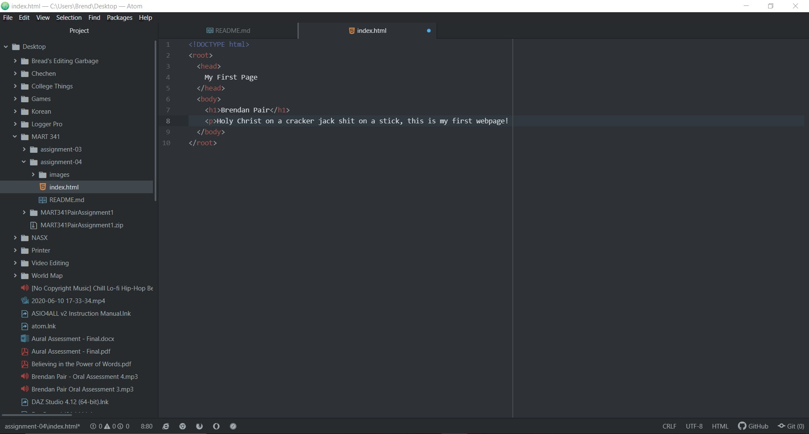

13. Browsers read the information from html, css, javascript, and any other languages used, and uses said information to generate a webpage.  I use Chrome and sometimes Firefox on my laptop and Brave on my cellphone.
14. A markup language is one that is used to tell browsers the content of the site. It is not focused on design, or interaction, but purely the content. Html is the most widely used markup language in web development. It is relatively simple to learn and deals primarily with the content of the site.

