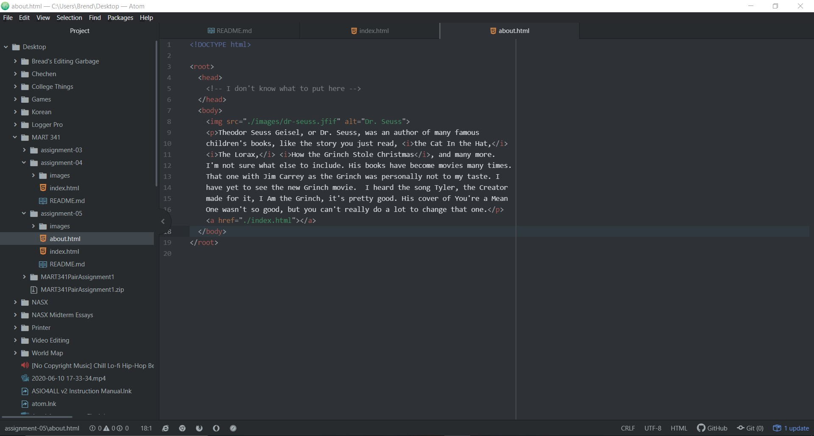

1. I went to youtube.com 10 years ago. Needless to say, it doesn't nearly look
how it does now. Firstly, it was white, aka there was no dark mode. Secondly,
the amount of videos shown is very small compared to the many, many videos it'll
show on the same page. YouTube apparently used Adobe Flash Player to play the
videos back then, which I did not know. The recommended videos were all about
Old Spice commercials or climate change, which is odd. There was a Spotlight
section, which I'm not sure the purpose of.
2. I learned that YouTube, like most sites, has evolved both visually and
functionally to be what ordinary people back then probably never saw possible.
Also, that Old Spice commercials were really popular at the time. It wasn't hard
to navigate, though there were far fewer options, so, naturally. It was difficult
to get videos to play, though, either because they weren't archived or because
the player kept buffering over and over.
3. 
